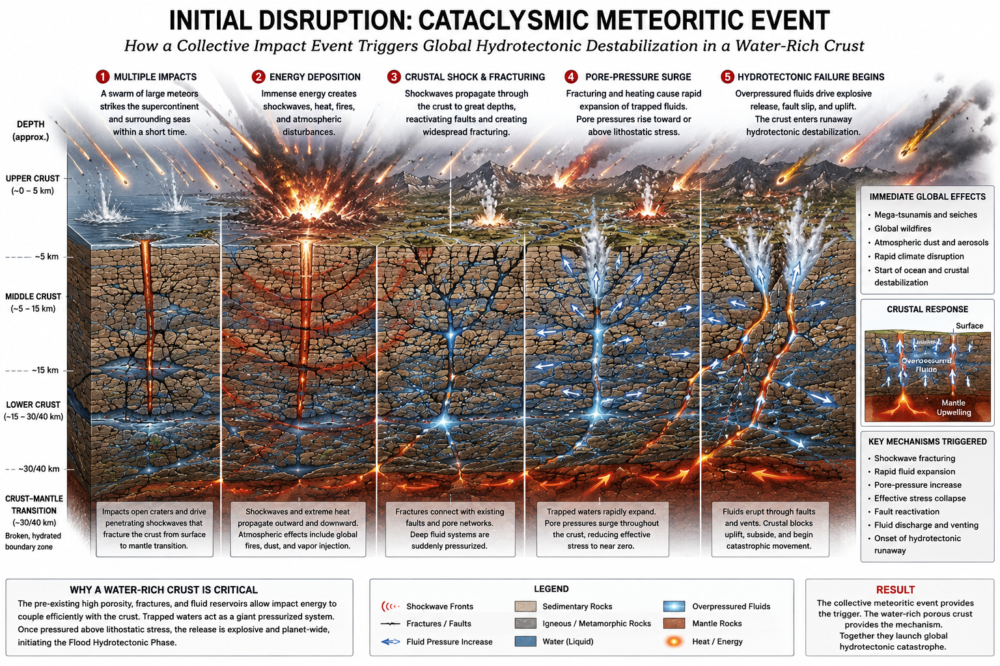
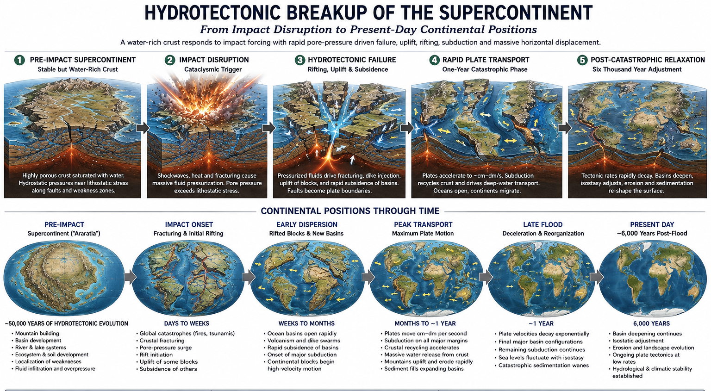
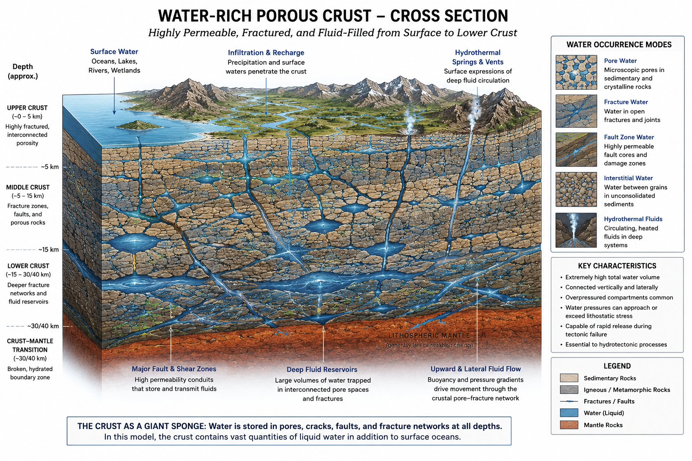

# The Global Hydrotectonic Flood Model: A Layered Mechanism for Rapid Continental Reorganization

**Status:** Draft v0.1, 2026-08-16. First position paper for this research programme (see `01-hypothesis/hard-core.md`, which anticipated this document before it existed). Zenodo submission packet (rendered PDF, metadata, checklist) staged in [`publishing/`](publishing/); not yet submitted — pending JD's own upload.

**Author:** James D. Longmire. ORCID: [0009-0009-1383-7698](https://orcid.org/0009-0009-1383-7698).

**Repository:** [github.com/jdlongmire/hydrotectonic-flood-model](https://github.com/jdlongmire/hydrotectonic-flood-model). Throughout this paper, bare relative paths in fixed-width text (for example, `02-theory/rheology/README.md`) are not hyperlinks — they name files at the repository above, which carries the full belt documentation, dated dev-notes, and the citation-validation ledger this paper summarizes. Prepend the repository URL to locate any such file.

---

## Abstract

This paper states, in one place, the current form of a research programme reconstructing the Genesis Flood as a real historical, geophysical event. The programme's hard core (Section 1) is a set of textual-historical and methodological commitments held by decision, not derived from physics. Its protective belt is a layered physical mechanism: continental hydroplaning under near-lithostatic pore pressure (Section 3) accounts for rapid lateral translation without the lethal frictional heating that has defeated prior catastrophic-plate-tectonics proposals; a separately scoped, localized reduction in mantle viscosity within active subduction channels (Section 4) is offered as a partial, not yet sufficient, account of vertical slab descent into the transition zone. A water-mass balance (Section 5) is checked both for total inventory and for supply rate under load. Two questions are stated as genuinely open rather than resolved: the magnitude of the remaining viscosity deficit for vertical subduction, and the stratigraphic timing of the catastrophic interval, where competing boundary hypotheses rest on field evidence that is itself disputed in the literature (Section 6). Six falsifiable discriminators are named, none yet evaluated against data (Section 7). The claim of this paper is methodological and mechanistic: that a testable physical account of the Flood as a real event can be built and checked in public, not that the account is complete or that its central claim has been demonstrated.

---

## 1. The Hard Core

Per `01-hypothesis/hard-core.md`, this programme holds five commitments immune from refutation by methodological decision, not logical necessity:

1. Genesis records real historical events: creation, the Fall, the Flood.
2. No deep-time entailment: the observational corpus does not entail a multi-Gyr history. This is not the stronger claim that the corpus is inconsistent with one.
3. A historical global Flood occurred: a single, real, geographically global catastrophic event.
4. Creation was deployed in a functionally mature state, and a real, non-zero creation-to-Fall interval followed it. The pre-Flood supercontinent, here named Araratia, and its water-saturated crust are read as deployed mature at creation rather than accumulated through antecedent natural process. This draws on [Designed Functional Maturity](https://github.com/jdlongmire/designed-functional-maturity) (DFM), a companion framework under independent development (Longmire, draft), which itself states it "does not automatically validate any particular theological claim, young-earth chronology, or six-day historical sequence." Importing it here is a decision, not a derivation from it.
5. Post-catastrophe natural law is stable, which is what makes the belt below testable at all.

The core is not offered as a scientific claim. What must earn scientific standing is the belt and, above all, whether the belt generates predictions that forbid an observation the rival account (ordinary historical geology) permits.

---

## 2. The Heat Problem

Every prior version of catastrophic plate tectonics has foundered on the same constraint. Moving continental blocks thousands of kilometers within a year, rather than the centimeters per year of ordinary plate motion, and dissipating that motion through conventional friction generates heat flux on the order of 600 W/m², roughly half the power of direct solar irradiance, radiating from the ground itself. Sustained over a flood year, this raises surface temperature by hundreds of Kelvin: not a survivable planet, and not a claim this programme is prepared to wave away. Any mechanism proposed below is required to answer this constraint quantitatively, not qualitatively.

**Figure 1.** The proposed trigger sequence: multiple large impacts deposit energy, fracturing the crust and driving a pore-pressure surge that initiates hydrotectonic failure. Impacts function here as threshold-crossing triggers, not as the displacement mechanism itself; the water-saturated crust (Section 5.1, Figure 2) supplies the mechanism proper (Section 3). Illustrative, not a claim about the mechanics of Section 3.2's energy budget.

---

## 3. Mechanism I: Hydroplaning (Lateral Translation)

**Figure 3.** The proposed breakup sequence (pre-impact supercontinent through post-catastrophic relaxation) and continental positions through time. Cropped from the source infographic to exclude its displacement-statistics panel, which stated a plate-velocity figure (~0.01 to 0.1 m/s) inconsistent both with this programme's own kinematics figure (9 to 40 cm/s) and with the internal inconsistency documented in Section 3.4; the uncropped original and the discrepancy are recorded in `04-visualization-assets/images/README.md`. The displacement distances shown elsewhere in the source infographic (2,000 to 6,000 km average, 8,000 to 12,000+ km maximum) are not affected and are consistent with the kinematics literature. Illustrative of sequence and geometry only; not a validated plate-motion reconstruction (Section 3.4).

### 3.1 Principle

The programme's answer to Section 2 is not increased tolerance for heat but the claim that the heat was never generated (Figure 1 illustrates the triggering sequence). When pore-fluid pressure $P_p$ within the crust approaches lithostatic stress $\sigma_L$, effective normal stress collapses:

$$\sigma_{eff} = \sigma_L - P_p \rightarrow 0$$

Terzaghi's effective-stress principle predicts that when $P_p$ reaches approximately 99% of $\sigma_L$, effective stress drops to roughly 1% of its full lithostatic value and Coulomb friction becomes correspondingly negligible. Continental blocks are proposed to hydroplane on thin water films along shallow detachment horizons rather than grind past one another under full frictional resistance. The observational analog cited for this class of behavior is submarine hydroplaning, in which mass-transport deposits travel anomalous distances on slopes of a few degrees, well beyond what conventional friction would predict, and which has both laboratory and field documentation independent of this programme.

### 3.2 Energy budget

Ported from Longmire (2025), *Global Flood Hydrotectonics* (v2.5), the mechanism's own worked energy account partitions approximately $10^{25}$ J of gravitational potential energy, stored by the emplacement of dense material at creation (Section 1, commitment 4) and released as continental blocks settle toward isostatic equilibrium, as follows: 94.2% remains as residual potential energy in the new configuration, 5.0% dissipates as friction, 0.5% as viscous dissipation, and 0.25% as seismic radiation. Under this partitioning, heat flux falls from the ~600 W/m² of Section 2 to approximately 20 W/m², and global temperature rise stays below 1 K rather than in the hundreds. The 100-fold reduction follows directly from Terzaghi's principle and is not an independent tuning.

### 3.3 Water supply under load

A hydroplaning mechanism requires that the fractured crust not drain faster than it is resupplied. Using Darcy's law over a stipulated channeled-porosity architecture (fracture permeability $k \sim 10^{-8}$ m², porosity 0.1 to 0.3, sponge thickness 1 to 5 km), consolidation-drainage demand under load is estimated at $Q_{required} \sim 5 \times 10^5$ m³/s, against a fracture-network supply of $Q_{available} \sim 4 \times 10^8$ m³/s: an excess supply capacity of roughly 800 to 1. This figure is robust to an order of magnitude of parameter uncertainty per the source document's own sensitivity analysis, but the porous-zone parameters themselves are stipulated, not independently measured, and have not yet been checked against this programme's own crustal model.

### 3.4 What is not yet resolved

The lateral-velocity claim carries a real, unresolved internal inconsistency, disclosed here rather than smoothed over. The source document's summary figure ("tens to hundreds of meters per hour," approximately 0.03 to 0.1 m/s) does not match its own worked force-balance calculation, which for a representative 800 × 1000 × 35 km block on a 0.1° slope with friction collapsed to $\mu = 0.01$ yields an acceleration of approximately 0.03 m/s² and, over a 15-minute interval, a velocity of approximately 30 m/s: roughly 1,000 times faster than the summary claim, a discrepancy that traces in part to a unit-conversion error in the source (30 m/s was there reported as "108 m/hr," when the correct conversion is 108,000 m/hr). This programme's independently derived continental-velocity figure (9 to 40 cm/s, from `02-theory/kinematics/README.md`) sits between the two: three to fifteen times faster than the summary claim and 75 to 300 times slower than the calculation's literal output. Detachment depth is likewise stated inconsistently in the source (50 km in the narrative text, 15 km in the worked calculation). Reconciling these figures against this programme's own displacement budget is stated as open work, not yet performed.

---

## 4. Mechanism II: Localized Subduction-Channel Softening (Vertical Descent)

### 4.1 Scope

Hydroplaning, as stated, accounts for lateral translation only. It does not address how crustal slabs descend vertically into the mantle transition zone, which the programme's water-mass balance (Section 5) requires for its deep-water-transport claim. This is a distinct physical problem, requiring a reduction in mantle viscosity rather than a reduction in surface friction, and the two mechanisms are not substitutes for one another.

### 4.2 The magnitude of the requirement

The initial research derives a required transient viscosity of $10^{13}$ to $10^{14}$ Pa·s during the catastrophic interval, against a present upper-mantle viscosity of $10^{20}$ to $10^{21}$ Pa·s. This requirement was first checked (2026-08-16) against the wrong comparison class, partial-melt subduction-channel weak zones, which bottom out near $10^{19}$ Pa·s in the mainstream geodynamic literature and yield a 5 to 6 order-of-magnitude shortfall. The programme's own proposed mechanism, however, is water content in transition-zone minerals (ringwoodite, wadsleyite), not partial melt, and the requirement is properly checked against that literature instead.

Fei et al. (2017), measuring dislocation mobility (inversely related to viscosity) in ringwoodite directly, report that anhydrous ringwoodite is approximately two orders of magnitude slower than bridgmanite, and that water-saturated ringwoodite is a further 1.5 orders of magnitude faster than bridgmanite: a combined reduction of approximately 3.5 orders of magnitude from anhydrous to water-saturated ringwoodite, the largest documented water-specific effect on the correct mineral. Applied to a standard transition-zone viscosity baseline of $10^{21}$ Pa·s, this reaches approximately $10^{17}$ to $10^{18}$ Pa·s: still short of the required $10^{13}$ to $10^{14}$ Pa·s by approximately 3 to 4 orders of magnitude. This is a genuine narrowing of the original problem, not its resolution.

Fei et al.'s own stated water-content conclusion, obtained from primary text (PMC5462500), is that "ringwoodite in the MTZ should contain 1 to 2 wt % water. The MTZ should thus be nearly water-saturated globally," with the caveat that this inference is best constrained "under the regions that have experienced postglacial rebound," that water solubility in ringwoodite decreases with increasing temperature, and that the authors themselves acknowledge unresolved discrepancies with independent electrical-conductivity studies of the transition zone.

### 4.3 The rescoping

Because lateral translation (Section 3) no longer depends on mantle viscosity, the viscosity requirement need only be satisfied within the narrow volume of active subduction channels, where water content is plausibly most concentrated in any case (the down-going slab), rather than across the bulk transition zone. This is the same move mainstream geodynamics already makes in treating subduction-channel weak zones as distinct from ambient mantle rheology, and it is a genuine narrowing rather than a rhetorical one. It is not yet a closed case: no calculation has been performed showing the localized-channel requirement is achievable, only that the requirement is smaller than previously framed. A vertical-descent rate calculation specific to subduction-channel material, distinct from both the lateral-velocity reconciliation of Section 3.4 and the viscosity-magnitude question above, has not yet been performed.

---

## 5. Water Mass Balance

### 5.1 Inventory

**Figure 2.** Cross-section of the pre-Flood water-rich crust: pore water, fracture water, fault-zone water, interstitial water, and hydrothermal fluids extending to the approximately 30 to 40 km crust-mantle transition. Illustrates the reservoir this section's mass balance quantifies; carries no independent numerical claim.

Using present-day USGS figures (1 ocean equivalent, OE, equals $1.338 \times 10^9$ km³ ocean water plus $2.34 \times 10^7$ km³ groundwater), the programme proposes a pre-Flood crustal-water excess of 0.05 to 0.15 OE, partitioned across upward discharge, deep transport, and retention in an illustrative 50/30/20 split. Deep-transported water is directed toward the mantle transition zone, consistent with Pearson et al. (2014), who report a natural ringwoodite inclusion within a diamond from transition-zone depth containing approximately 1.4 to 1.5 wt % water: direct physical evidence that the transition zone has hosted significant water at some point, though not evidence of when. The excess magnitude, partition coefficients, and resulting mantle-water inventory are stated in the initial research as hypothesis parameters, not measured quantities, and no independent constraint has yet been proposed for any of them.

### 5.2 Supply rate

See Section 3.3.

### 5.3 The vapor canopy, ruled out as a source

An inferred pre-Flood atmospheric water-vapor canopy was checked against the range actually proposed in that literature (Whitcomb & Morris 1961; Dillow 1981; Vardiman, various). At the largest canopy depth Vardiman's own climate modeling found compatible with a habitable surface (approximately 51 cm precipitable water), the canopy contributes approximately $1.9 \times 10^{-4}$ OE, roughly 0.1 to 0.4% of the crustal-water excess already carrying this programme's mass balance. Dillow's original, larger proposal (approximately 12.2 m precipitable water) implies, by Dillow's own corrected greenhouse calculation, a surface temperature of 1,144°C. Across the full range the literature itself has proposed, the canopy cannot contribute materially to the water budget without becoming thermodynamically uninhabitable. This is also the conclusion the canopy's own proponents at the Institute for Creation Research have reached, favoring instead crustal and deep-mantle water release during the Flood event, which is the mechanism this programme already employs.

---

## 6. Open Questions

Two questions are stated here as genuinely open, not resolved by the mechanisms above.

### 6.1 The vertical-subduction magnitude

Section 4.2's residual 3 to 4 order-of-magnitude viscosity deficit, even rescoped to localized subduction channels, has not been shown to close. Candidate closing mechanisms, thermal feedback during descent, strain-rate localization, or an effect not yet quantified in the literature, remain unquantified. The programme's stated position is that this may be shown to be physically excluded, which would itself be a real result under the programme's own falsification standard (Section 7).

### 6.2 Stratigraphic timing

The initial research tested three candidate boundaries for the onset of the catastrophic interval, Cambrian onset, then Permian-Triassic, Triassic-Jurassic, and Cretaceous-Paleogene (K-Pg), against the fossil and soil record, and reported all three as failing on the same class of evidence: paleosols, coal, and reef structures recurring stratigraphically past every candidate boundary, including K-Pg. That evidence is real. Whether it is correctly identified is a separate, live dispute in the literature that the initial research did not engage.

Specifically, Oard and Klevberg (2022), conducting field work in the Fort Union Group at Theodore Roosevelt National Park, the formation immediately above the K-Pg boundary and thus the interval most directly relevant to the K-Pg rejection above, report field evidence disputing the specific paleosol identification: no soil profile beneath the petrified stumps interpreted by Biek and Gonzalez (2001) as successive coniferous forests, but rather iron horizons and concretions associated with bentonite beds, with the alternative interpretation of transported log mats buried rapidly rather than centuries of in-place forest growth. Doyle (2017), addressing laterite and bauxite soil formation more generally, reaches a comparably modest conclusion: recent literature "provides some potential solutions" but "more work clearly needs to be done."

The programme's position is accordingly that the case against the tested boundaries is weaker than the initial research represented it to be, without this constituting a positive case for any one of them. The current proposal, an undefined diachronous propagation front $t_C(x)$, carries zero specified geometry or initiating location as of this writing.

---

## 7. Discriminators

Following the programme's own standard (`03-prediction/discriminators.md`), a discriminator must forbid an observation, must be one the rival account (ordinary historical geology) does not equally forbid, must be evaluable against a defined sample, and must state its failure condition before evaluation. Six candidates are named; none has yet been run against data.

1. **Ecological-province co-occurrence.** If stratigraphic ordering results primarily from progressive geographic destruction of ecological provinces rather than temporal succession, taxa co-occurring geographically before the catastrophe should co-occur stratigraphically more often than taxa separated by habitat geography, controlling for transport and preservation.
2. **Cross-basin coherent propagation front.** Onset of high-energy catastrophic sedimentation across several independently characterized basins should compose into one geographically coherent, year-bounded propagation field. Currently unspecified in geometry.
3. **Mantle transition-zone hydration spatial correlation.** Not yet a discriminator as stated; the cited pattern (colder, more hydrated subducted-slab regions) is equally predicted by ordinary gradual subduction and requires sharpening to discriminate.
4. **Seismic texture discontinuity.** Tomography should show a discontinuity between chaotic, reworked upper lithosphere (0 to 200 km) and coherent, undisturbed deep mantle (>400 km), against ordinary plate tectonics' prediction of smoother, gradational structure.
5. **Fluid-dominated detachment fabric.** Large-scale detachment horizons should show predominantly fluid-related fabrics with minimal pseudotachylite, against a prediction of significant frictional melt under sustained high-friction sliding.
6. **Basin-margin megabreccia signature.** Chaotic, multi-lithology, rapid-emplacement megabreccia at basin boundaries, distinguishing rapid hydroplaning-driven emplacement from slow accumulation.

---

## 8. Limitations

Stated plainly, following the programme's own standing discipline:

- The hard core is immune by decision, not by demonstration, and a reader is not irrational to reject it.
- Two internal figures (lateral velocity, detachment depth) are inconsistent within the source material this programme draws from and have not yet been reconciled against this programme's own parameters.
- The vertical-subduction viscosity deficit, even rescoped, has not been closed.
- Water-ledger partition coefficients are hypothesis parameters, not measured or independently constrained.
- The stratigraphic timing question has no positive candidate as of this writing, only a disputed negative case against three tested candidates.
- None of the six named discriminators has been evaluated against actual data.
- The hydroplaning mechanism's own porous-zone and force-balance parameters are stipulated, imported from a companion document, and have not been independently derived or measured for this programme's specific crustal model.

## 9. References

Doyle, S. (2017). Do 'laterite' soils take a million years to form? *Journal of Creation*, 31(3), 5-7.

Fei, H., Yamazaki, D., Sakurai, M., Miyajima, N., Ohfuji, H., Katsura, T., & Yamamoto, T. (2017). A nearly water-saturated mantle transition zone inferred from mineral viscosity. *Science Advances*, 3(6), e1603024. https://doi.org/10.1126/sciadv.1603024

Longmire, J.D. (2025). *Rapid Continental Reorganization Through Hydraulic Collapse: A Solution to the Heat Problem in Catastrophic Plate Tectonics* (v2). Zenodo. https://doi.org/10.5281/zenodo.17684983. Repository (working development, v2.5 Gap Analysis Edition): https://github.com/jdlongmire/global-flood-hydrotectonic-model

Longmire, J.D. (draft). *Designed Functional Maturity as Methodological Designism: An Explanatory Framework for Foundational Features of Reality*. https://github.com/jdlongmire/designed-functional-maturity

Oard, M.J., & Klevberg, P. (2022). Petrified Ideas of the Williston Basin, Part II: Fossil Wood. *Creation Research Society Quarterly*, 58(3), 204-219.

Pearson, D.G., Brenker, F.E., Nestola, F., McNeill, J., Nasdala, L., Hutchison, M.T., Matveev, S., Mather, K., Silversmit, G., Schmitz, S., Vekemans, B., & Vincze, L. (2014). Hydrous mantle transition zone indicated by ringwoodite included within diamond. *Nature*, 507, 221-224.

United States Geological Survey. Water Science School: How Much Water is There on Earth? usgs.gov/water-science-school.

Vardiman, L. Institute for Creation Research, vapor canopy climate modeling. Referenced via `02-theory/water-ledger/README.md`.

Whitcomb, J.C., & Morris, H.M. (1961). *The Genesis Flood: The Biblical Record and Its Scientific Implications*. Presbyterian and Reformed Publishing.

---

*This document traces to `01-hypothesis/hard-core.md`, `02-theory/kinematics/README.md`, `02-theory/rheology/README.md`, `02-theory/water-ledger/README.md`, `02-theory/stratigraphy/README.md`, and `03-prediction/discriminators.md` as of 2026-08-16. Where this paper and a belt document diverge in the future, the belt document is authoritative and this paper is due for revision. Every citation's confidence level, retrieval status, and primary-source-verification state is recorded in [`../research/citation-validation.md`](../research/citation-validation.md).*
